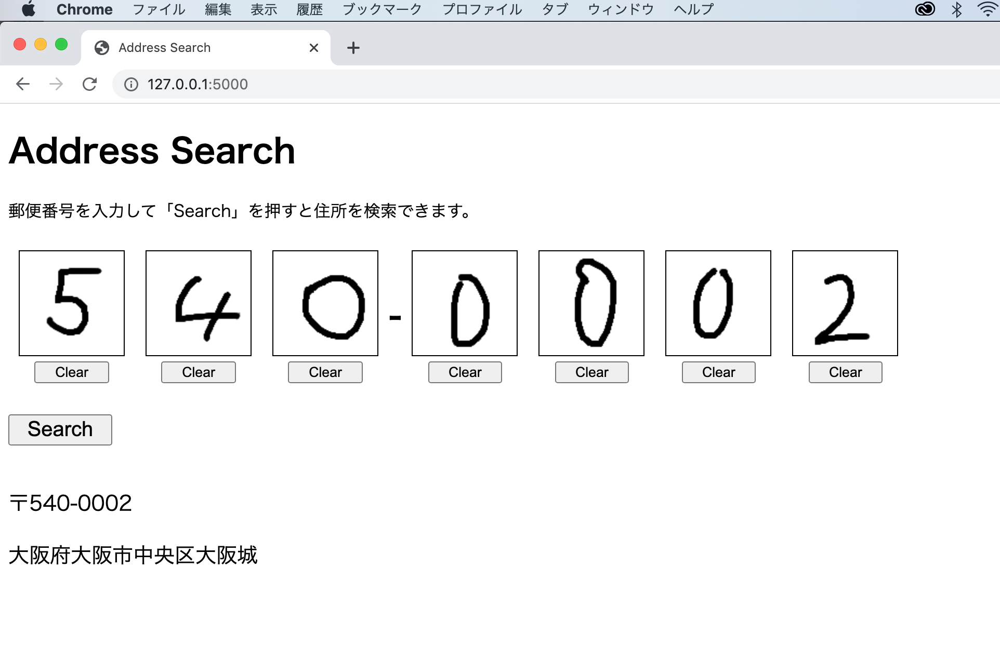

# AddressSearchTool
This is searching tool of address in Japan from handwritten numbers.

## Demo


## Environment
Install Python 3.x and run following command.
```bash
pip install -r requirements.txt
```

## Training images of number
Run following command to train images.
After runnning this, Neural Network model named "model.npz".
```bash
python recognition/training.py
```

## Run Web Application
Run app.py as following.
```bash
python app.py
```
Access to http://127.0.0.1:5000/ after running the command.
Write numbers in the box.
Then, numbers are recognized and show the address by searching it using zip code API.
